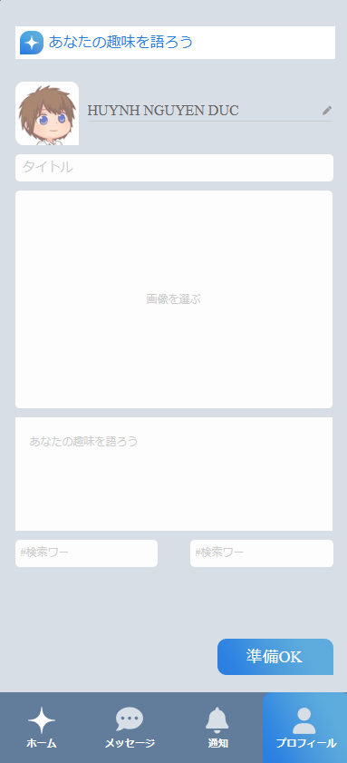

# OddballTalk

"OddballTalk is a matching application built with Express.js during a three-day web training camp event."

  
  
  
  

## Description

This application allows users to create and manage conversations.

## Installation

To install and run this application, follow these steps:

1. Clone this repository.
2. Run `npm install` to install dependencies.
3. Create a `.env` file based on the `.env.example` file and fill in the necessary information.
4. Run `npm run dev` to start the application.

## Project Structure

This project includes the following directories:

- `src/config`: Contains configuration files such as `firebase-config.js` and `viewEngine.js`.
- `src/controllers`: Contains controllers such as `apiControllers.js`.
- `src/public`: Contains resources such as CSS, JavaScript, and images.
- `src/routers`: Contains routers such as `api.js`, `uploadTest.js`, and `web.js`.
- `src/views`: Contains EJS view files.

## Author

OddballTalk was created by [Huynh](https://github.com/huynhnguyen1906).
and [IidaTomonari](https://github.com/Iidaaaaaa).

## Contribution

Contributions are welcome. Please fork the repository and create a pull request with your changes.
